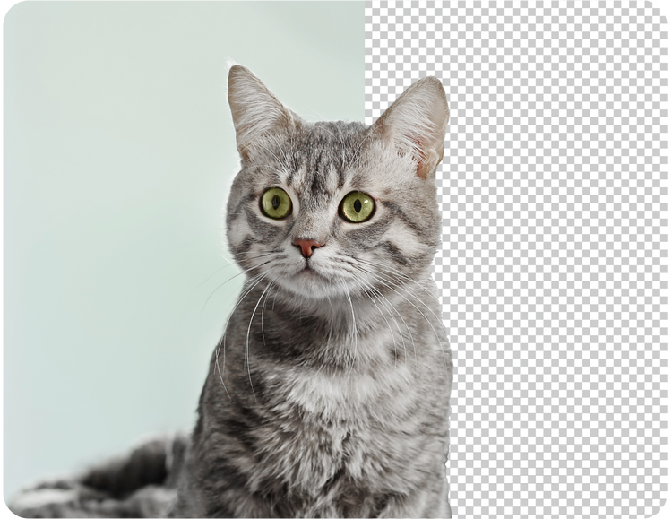

# Manual de Markdown 
 # Encabezados 
 Para crear un encabezado, utilice el símbolo de almohadilla "#" al principio de una línea.
 * ejemplo:
 * #texto
 * ##texto

 # Texto básico

Para aplicar negrita al texto, se escribe entre dos asteriscos.

* `**hola**`

Para aplicar cursiva al texto, se escribe entre un solo asterisco.

* `*hola*`

para aplicar negrita y cursiva al texto, se escribe entre tres asteriscos.

* `***hola mundo***`

# Listas numeradas y listas con viñetas
Para crear listas numeradas, empiece una línea con 1. or 1

* `1. primer hola mundo`
* `2. segundo hola mundo` 

Para crear listas de viñetas, empiece una línea con *, - o +
* `* hola`
* `- hola`

# Nota
>[!NOTE]
   > 
   >que hacen.

+ `>[!hola]`
+ ` >` 
+ `>que hacen.`

# Imágenes 
` `

# tablas 
 Puede crear tablas utilizando la barra vertical (|) para definir columnas y filas. Los guiones crean el encabezado de cada columna, mientras que las barras verticales separan las columnas. Incluya una línea en blanco antes de la tabla para que se muestre correctamente.

 * `| nombres | apellidos | género  |`
* `|--- |--- |--- |`
* `| Andrés mauricio| noscue cerquera|M |`
* `|  María isabel |tovar pastrana | F |`

 | nombres | apellidos | género  |
 |--- |--- |--- |
 | Andrés mauricio| noscue cerquera|M |
 |  María isabel |tovar pastrana | F |

 # Vínculos
 [github](https://github.com/MauricioNoscue)